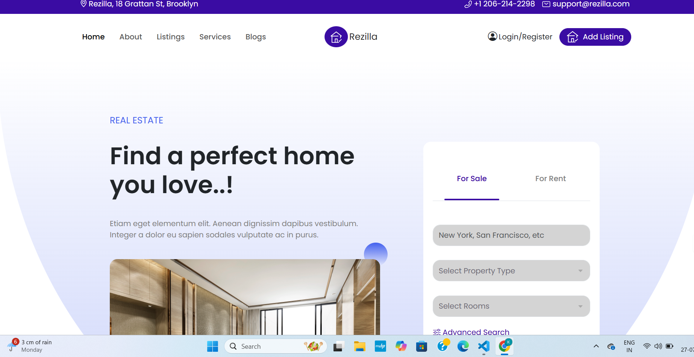
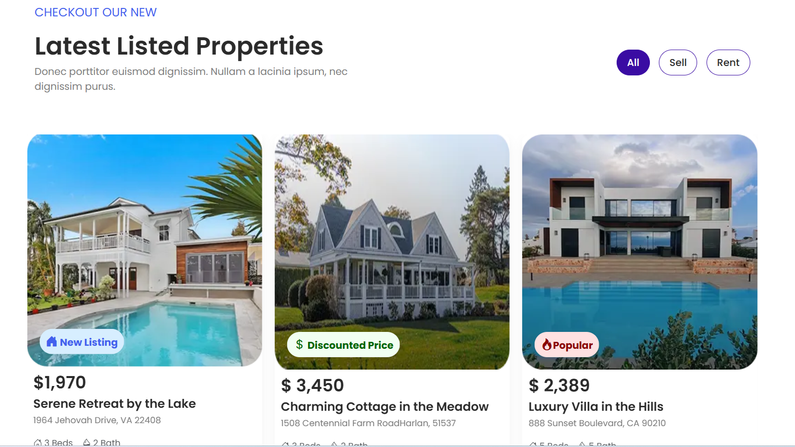

# About   
=>Rezilla is a responsive real estate landing page showcasing properties, services, and agents using HTML, CSS (Bootstrap), SCSS and JavaScript.

# Features
=> Responsive layout with Bootstrap Grid
=> Image carousel (Bootstrap)
=> SEO-friendly structure
=> Agent registration section
=> Newsletter subscription form
=> Swipper
=> JavaScript 

# Clone the repository
https://github.com/khus759/rezilla-real-estate/tree/dev

# Navigate to the folder
cd rezilla-real-estate

# Open index.html in your browser

# Homepage Preview

# Listed properties preview

# Netifly
https://clinquant-dragon-6c8ddd.netlify.app/